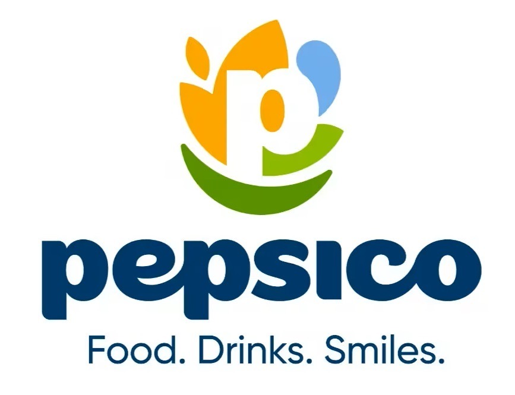

# PepsiCo Engineering CMMS

<p align="center">
  
</p>

<p align="center">
  <strong>Computerized Maintenance Management System</strong><br>
  Comprehensive equipment maintenance tracking and preventive maintenance management
</p>

---

## 📋 Overview

PepsiCo Engineering CMMS is a full-featured web-based Computerized Maintenance Management System designed specifically for PepsiCo manufacturing facilities. The system manages work orders, preventive maintenance schedules, equipment tracking, inventory management, cost analysis, and comprehensive reporting through Power BI integration.

**Built with:**
- Laravel 12 (PHP 8.4)
- Filament v4 Admin Panel
- MySQL 8.0
- Livewire 3
- Pest PHP Testing Framework

---

## ✨ Key Features

### 🔧 Work Order Management
- Complete work order lifecycle (Submitted → Reviewed → Approved → In Progress → Completed → Closed)
- Multi-step approval workflow with role-based permissions
- Real-time MTTR (Mean Time To Repair) calculation
- Downtime tracking and cost calculation
- Equipment hierarchy (Area → Sub Area → Asset → Sub Asset)
- QR code generation for quick asset access
- Work order process tracking with technician assignment
- Parts usage tracking with automatic inventory sync

### 🗓️ Preventive Maintenance (PM)
- Flexible scheduling (Daily, Weekly, Bi-Weekly, Monthly, Quarterly, Annually)
- Automated PM execution generation based on schedules
- PM compliance tracking and on-time performance metrics
- Customizable checklist items per PM schedule
- Department-based technician assignment
- PM cost tracking (labor, parts, overhead)
- Performance scoring system for technicians
- Cascade scheduling for dependent equipment

### 📦 Inventory Management
- Real-time stock level tracking
- Two-way sync between Parts and Inventories modules
- Min/max stock levels with automatic alerts
- Stock movement history
- Low stock notifications
- Multi-location inventory support
- Parts usage tracking from WO and PM
- Barcode/QR code integration

### 💰 Cost Tracking
- Work order costs (labor, parts, downtime)
- PM execution costs (labor, parts, overhead)
- Department-wise cost analysis
- Equipment-wise cost breakdowns
- Monthly/quarterly cost reporting
- Cost center allocation

### 👥 User Management
- Role-based access control (Super Admin, Manager, Assistant Manager, Technician, Tech Store, Operator)
- Department-based user assignment
- GPID-based authentication
- Password management (change, forgot password)
- Excel/CSV user import functionality
- Activity logging for all user actions

### 📊 Reporting & Analytics
- Power BI integration for executive dashboards
- Pre-built database views for common reports
- Work order analysis and trends
- PM compliance tracking
- Equipment performance metrics
- Technician performance scorecards
- Cost analysis by department/equipment
- Inventory valuations and usage reports

### 🎨 PepsiCo Branding
- Custom PepsiCo login page with branded background
- PepsiCo logo in navigation and sidebar
- PepsiCo blue color scheme (#004b93)
- Glassmorphism login card design
- Custom favicon

---

## 🚀 Installation

### Prerequisites
- PHP 8.2 or higher (recommended: PHP 8.4)
- Composer
- MySQL 8.0 or higher
- Node.js 18+ and npm (for asset compilation)
- Web server (Apache/Nginx)

### Step-by-Step Setup

1. **Clone the repository**
```bash
git clone <repository-url>
cd cmmseng
```

2. **Install PHP dependencies**
```bash
composer install
```

3. **Install JavaScript dependencies**
```bash
npm install
```

4. **Environment configuration**
```bash
cp .env.example .env
php artisan key:generate
```

5. **Configure database** (edit `.env`)
```env
DB_CONNECTION=mysql
DB_HOST=127.0.0.1
DB_PORT=3306
DB_DATABASE=cmmseng
DB_USERNAME=root
DB_PASSWORD=
```

6. **Run database migrations**
```bash
php artisan migrate --seed
```

7. **Create storage symlink**
```bash
php artisan storage:link
```

8. **Build frontend assets**
```bash
npm run build
```

9. **Start development server**
```bash
php artisan serve
```

10. **Access the application**
- URL: `http://127.0.0.1:8000/pep/login`
- Default credentials: Check your seeder or create user manually

---

## ⚙️ Configuration

### Filament Panel
The system uses a custom Filament panel named "pep". Configuration is in:
- `app/Providers/Filament/PepPanelProvider.php`

### Role & Permissions
Roles and permissions are managed using Spatie Laravel Permission package:
- Super Admin: Full system access
- Manager: Approve WO, manage PM schedules
- Assistant Manager: Department-specific WO/PM management
- Technician: Execute PM, process WO
- Tech Store: Manage inventory
- Operator: Submit WO via barcode

Configure in: `database/seeders/RolePermissionSeeder.php`

### Equipment Hierarchy
The system supports 4-level equipment hierarchy:
1. **Area** (e.g., Production Line A)
2. **Sub Area** (e.g., Filling Section)
3. **Asset** (e.g., Filler Machine #1)
4. **Sub Asset** (e.g., Nozzle Assembly)

Configure cascade dropdown behavior in: `config/cmms.php`

### Power BI Integration
For reporting and analytics, the system provides:
- Read-only database user: `powerbi_readonly`
- 6 optimized database views (see `database/powerbi_views.sql`)
- Direct database connection or API endpoints

Setup instructions: `POWERBI_INTEGRATION.md`

---

## 🧪 Testing

The project uses **Pest PHP** testing framework with 167 automated tests covering:
- Feature tests (Work Orders, PM, Inventory, Users)
- Unit tests (Models, Services, Policies)
- Browser tests (Livewire components)

### Run all tests
```bash
php artisan test
```

### Run specific test suite
```bash
php artisan test --testsuite=Feature
php artisan test --testsuite=Unit
```

### Run with coverage
```bash
php artisan test --coverage
```

### Test results
- **167 tests passing** (100% success rate)
- **315 assertions**
- All security tests passing (XSS, SQL injection, RBAC)

---

## 📚 Documentation

- **WORKFLOW.md** - Detailed system workflows and business logic
- **CHECKLIST.md** - Complete development checklist (Phases 1-19)
- **POLICY_PERMISSION_GUIDE.md** - Role-based access control guide
- **POWERBI_INTEGRATION.md** - Power BI setup and configuration
- **DEPLOYMENT_READINESS_REPORT.md** - Pre-deployment checklist
- **ARCHITECTURE.md** - System architecture (coming soon)

---

## 🔒 Security

### Authentication & Authorization
- GPID-based authentication
- Role-based access control (RBAC) with Spatie Permission
- Policy-based authorization for all resources
- Password reset functionality
- Session management

### Data Protection
- XSS protection (all inputs sanitized)
- SQL injection prevention (Eloquent ORM)
- CSRF protection on all forms
- Soft deletes for data retention
- Activity logging for audit trail

### Security Audit Results
- ✅ Zero dependency vulnerabilities (composer audit)
- ✅ All 167 automated tests passing
- ✅ No XSS vulnerabilities detected
- ✅ No SQL injection vulnerabilities
- ✅ RBAC properly enforced

Report security vulnerabilities to your security team.

---

## 🛠️ Tech Stack

### Backend
- **Framework:** Laravel 12
- **Language:** PHP 8.4
- **Database:** MySQL 8.0
- **Admin Panel:** Filament v4
- **Permissions:** Spatie Laravel Permission v6

### Frontend
- **UI Framework:** Filament v4 (built on Livewire 3)
- **CSS:** Tailwind CSS
- **JavaScript:** Alpine.js
- **Icons:** Heroicons

### Development Tools
- **Testing:** Pest PHP v4
- **Code Style:** Laravel Pint
- **Browser Testing:** Laravel Dusk
- **Debugging:** Laravel Boost, Laravel Pail
- **PDF Generation:** DomPDF
- **QR Codes:** SimpleSoftwareIO QR Code
- **Excel Import/Export:** Filament Excel

### Integrations
- **Power BI:** Direct database connection + optimized views
- **Telegram Bot:** Notification support (optional)
- **Image Processing:** Intervention Image v3

---

## 📂 Project Structure

```
cmmseng/
├── app/
│   ├── Filament/           # Filament resources, pages, widgets
│   ├── Http/               # Controllers, middleware
│   ├── Livewire/           # Livewire components
│   ├── Models/             # Eloquent models
│   ├── Observers/          # Model observers
│   ├── Policies/           # Authorization policies
│   ├── Services/           # Business logic services
│   └── Traits/             # Reusable traits
├── database/
│   ├── migrations/         # Database schema
│   ├── seeders/            # Database seeders
│   ├── powerbi_setup.sql   # Power BI user setup
│   └── powerbi_views.sql   # Reporting views
├── public/
│   ├── images/             # PepsiCo branding assets
│   └── css/                # Custom CSS
├── resources/
│   ├── views/              # Blade templates
│   └── js/                 # JavaScript files
├── routes/
│   ├── web.php             # Web routes
│   └── console.php         # Artisan commands
├── tests/
│   ├── Feature/            # Feature tests
│   └── Unit/               # Unit tests
├── CHECKLIST.md            # Development progress
├── WORKFLOW.md             # System workflows
└── POWERBI_INTEGRATION.md  # Power BI guide
```

---

## 🤝 Contributing

This is a private enterprise application. Contributions are managed internally.

---

## 📄 License

Proprietary - PepsiCo Engineering Department

---

## 📞 Support

For technical support or questions:
- **Internal Team:** Contact PepsiCo Engineering IT Support
- **Documentation:** See `WORKFLOW.md` and `CHECKLIST.md`
- **Issues:** Report to project manager

---

## 🎯 Roadmap

### Phase 18: Deployment
- [ ] VPS server setup
- [ ] SSL certificate installation
- [ ] Production environment configuration
- [ ] Database backup automation

### Phase 19: User Training
- [ ] Training materials creation
- [ ] User training sessions (by role)
- [ ] Feedback collection
- [ ] System optimization based on feedback

See `CHECKLIST.md` for complete project roadmap.

---

**Last Updated:** November 26, 2025  
**Version:** 1.0.0  
**Status:** Pre-Production (Phase 17 - Documentation)
